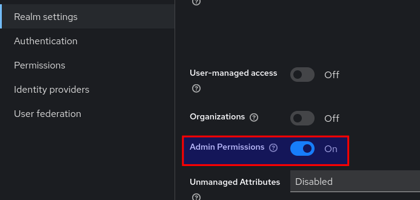
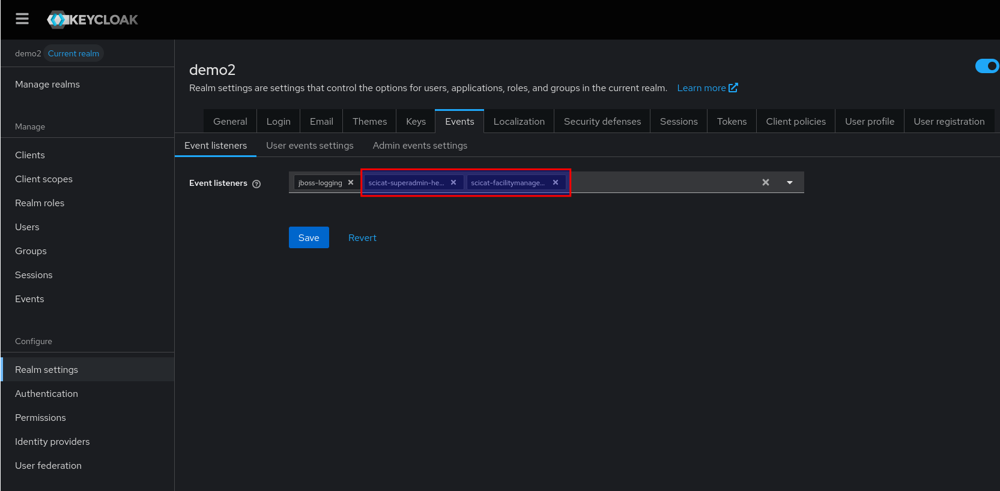

Building
========

`mvn clean package`

`cp ./target/keycloak-facilities-admin-plugin-*.jar docker/plugins/`

`docker compose up --build`

Realm setup
===========

1. Optionally create a new realm
2. Enable Admin Permissions 
3. Activate Event Listeners: Add `scicat-facilitymanager-helper` and `scicat-superadmin-helper` to the list of event listeners 
tbc
4. create a group `psi--initnewfacility`