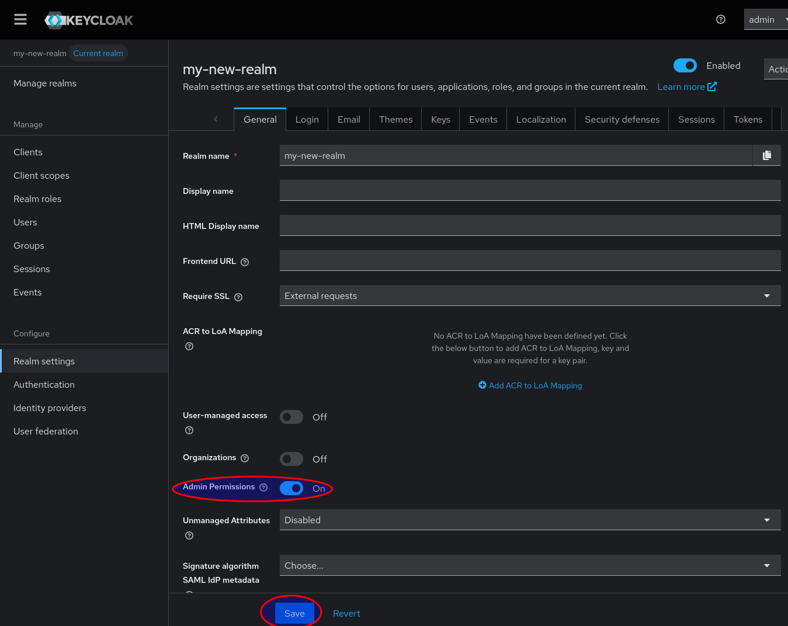
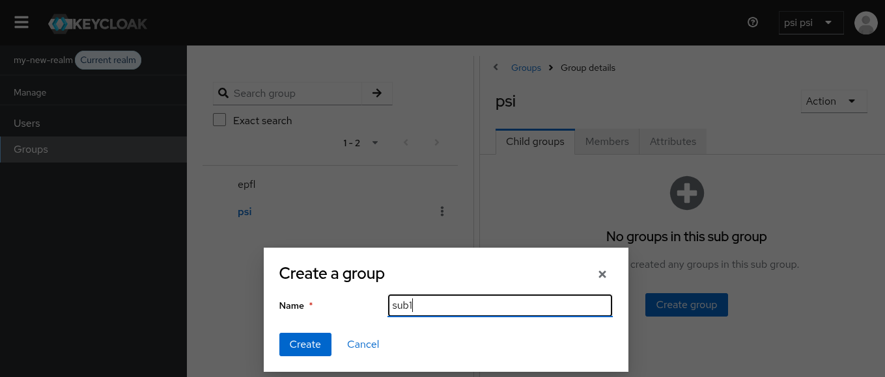

# Setup instructions for new realm / new keycloak instance

## Intro
By default, the plugin is not active on a new realm. It has to be activated by enabling its two event listeners.

## Compilation
Use `mvn package` for compiling, or `mvn verify` to make sure that all tests are also run.

(standard `mvn` behavior)

## Installations on docker / file level

Checkout the following dockerfile (simplified copy of docker/Dockerfile)

    FROM quay.io/keycloak/keycloak:26.2.5
    
    USER root
    COPY plugins/*.jar /opt/keycloak/providers/
    USER 1000
    RUN /opt/keycloak/bin/kc.sh build
    RUN /opt/keycloak/bin/kc.sh show-config | grep keycloak-facilities-admin-plugin
    
    ENTRYPOINT ["/opt/keycloak/bin/kc.sh", "start-dev"]

What has to be done:
* Copy the jar file from `./target/keycloak-facilities-admin-plugin-1*.jar` to `/opt/keycloak/providers/` inside the docker container
* Run `/opt/keycloak/bin/kc.sh build` which will link the plugin to keycloak
* Optionally, call `/opt/keycloak/bin/kc.sh show-config | grep keycloak-facilities-admin-plugin`. it is a check that the plugin is listed as part of keycloak

## Setting up realm (superadmin tasks)
1. Manage realms -> Create realm:
   
2. Keycloak automatically switches into the new realm:
   
3. In Realm settings, enable Admin permissions:
   
4. In Realm settings -> Events, add the event listeners `scicat-facilitymanager-helper` and `scicat-superadmin-helper`:
   
5. In Groups, create a new group with name `<facilityName>--initnewfacility`:
   
   The suffix is automatically removed. This step also creates the necessary permissions and a manager user, see [Workflows documentation](workflows.md).
   Repeat this step for each facility you like to set up
6. Manually create a new permission with the following details:
    - Type: Users
      
    - Name: "Manage group membership"
    - Scopes: `view`, `manage-group-membership`
    - Enforce to: All Users
      
    - Click "Create new policy"
      - Name: "All admins"
      - Policy Type: User
      - Users: add all admins
      - Logic: Positive
        
      - Save
    - Save
7. Set credentials for the manager users:
   

## This is what it looks like now 

## Create a new subgroup as Facility Manager
The following is not a checklist. More a list of options what you can do:

1. Login as Facility Manager (given you have credentials set as superadmin). The Url is like http://localhost:8024/admin/my-new-realm/console/, you can get it from superadmin view Clients->"security-admin-console", the URL is on the right.
   
2. This is what it looks like now:
   
   
3. Create a subgroup in your facility:
   
   The plugin automatically sets policy, permission and attribute to the newly created subgroup.
4. Create a user. (note: you need to add a group or subgroup, otherwise you get a permission error)
   
5. Add and Remove to/from your groups and subgroups
6. Also add users of other facilities  
   ⚠ Right now, this doesn't seem to work (in this case, I tried to add an epfl user)
   
